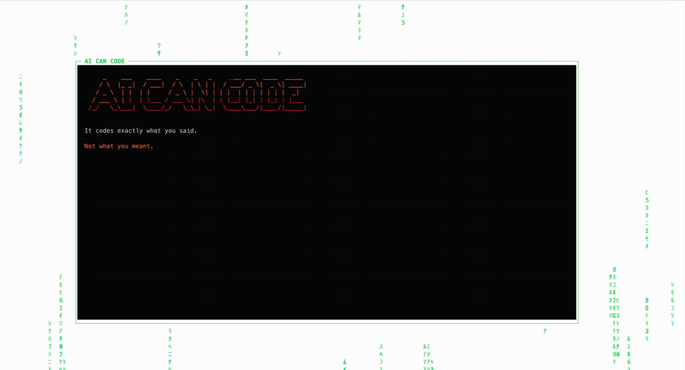

# term-deck

A terminal-based presentation tool with a cyberpunk aesthetic. Create beautiful slideshows in your terminal with matrix rain backgrounds, glitch effects, and ASCII art.


## Demo



*Matrix rain backgrounds, glitch animations, and ASCII art in your terminal*

## Features

- 🌊 **Matrix Rain Background** - Animated katakana/symbol rain effects
- ✨ **Glitch Reveal Animations** - Line-by-line scramble effects
- 🎨 **Built-in Themes** - Matrix, Neon, Retro, Minimal, Hacker
- 📝 **Markdown Slides** - One file per slide, easy to version control
- 🎯 **Figlet ASCII Art** - Big text rendered with figlet
- 🎭 **Custom Gradients** - Color gradients for headings
- 📹 **Export to Video** - Export presentations to MP4 or GIF
- 🎬 **Record to Asciicast** - Record for asciinema playback
- 📋 **Presenter Notes** - Speaker notes in a separate terminal
- 🔧 **Fully Themeable** - Create custom themes
- ⚡ **Beautiful CLI** - Colorful, styled terminal output
- 📦 **Type-Safe** - Full TypeScript with Zod validation

## Installation

```bash
# npm
npm install -g @pep/term-deck

# pnpm
pnpm add -g @pep/term-deck

# npx (no install)
npx @pep/term-deck init my-talk
```

## Quick Start

```bash
# Create a new presentation
term-deck init my-talk

# Start presenting
cd my-talk
term-deck present .

# Export to video
term-deck export . -o presentation.mp4
```

Output:
```
┌  Creating my-talk
│
◆  Created my-talk/
│
◇  cd my-talk
◇  term-deck present .
│
└  Ready to present!
```

This creates:
```
my-talk/
├── 01-intro.md
├── 02-content.md
├── 03-end.md
├── deck.config.js
└── README.md
```

## CLI Reference

Run `term-deck --help` to see the styled help:

```
┌─────────────────────────────────────────────────────────────┐
│                       term-deck                             │
│  Terminal presentation tool with a cyberpunk aesthetic      │
└─────────────────────────────────────────────────────────────┘

▶ QUICK START:

  ⚡  Create a new deck
      term-deck init my-talk

  🎬  Start presenting
      cd my-talk && term-deck present .

  📹  Export to video
      term-deck export . -o presentation.mp4

▶ COMMANDS:

  present <dir>        Start a presentation
    -s, --start <n>       Start at slide number
    -n, --notes           Show presenter notes
    -l, --loop            Loop back after last slide

  export <dir>         Export to GIF or MP4
    -o, --output <file>   Output file (.mp4 or .gif)
    -w, --width <n>       Terminal width (default: 120)
    -h, --height <n>      Terminal height (default: 40)
    --fps <n>             Frames per second (default: 30)
    -t, --slide-time <n>  Seconds per slide (default: 3)
    -q, --quality <n>     Quality 1-100 (default: 80)

  init <name>          Create a new presentation deck
    -t, --theme <name>    Theme preset (default: matrix)

▶ HOTKEYS:

  Space / →   Next slide
  ←           Previous slide
  0-9         Jump to slide
  l           Show slide list
  q           Quit
```

## Keyboard Controls

| Key | Action |
|-----|--------|
| `Space` / `Enter` / `→` | Next slide |
| `←` / `Backspace` | Previous slide |
| `0-9` | Jump to slide |
| `l` | Show slide list |
| `q` / `Esc` | Quit |

## Slide Format

Each slide is a markdown file with YAML frontmatter:

**01-intro.md**
```markdown
---
title: Welcome
bigText: HELLO
gradient: fire
---

{GREEN}Welcome to my presentation!{/}

This is the body text of the slide.
```

**02-content.md**
```markdown
---
title: Main Point
bigText:
  - MULTI
  - LINE
gradient: cool
---

{WHITE}You can have multiple bigText lines.{/}

{CYAN}And use color tokens for styling.{/}

<!-- notes -->
These are presenter notes.
Only visible in notes mode (-n flag).
```

### Frontmatter Options

| Field | Type | Description |
|-------|------|-------------|
| `title` | string | Window title (required) |
| `bigText` | string \| string[] | ASCII art text via figlet |
| `gradient` | string | Gradient for bigText: `fire`, `cool`, `pink`, `hf` |
| `transition` | string | Animation: `glitch`, `fade`, `instant`, `typewriter` |

### Text Colors

Use color tags in your slide content:

```markdown
{GREEN}green text{/}
{ORANGE}orange text{/}
{CYAN}cyan text{/}
{PINK}pink text{/}
{WHITE}white text{/}
{GRAY}gray text{/}
{RED}red text{/}
```

## Configuration

Create a `deck.config.js` in your slides directory:

```javascript
// deck.config.js
export default {
  title: 'My Presentation',

  // Use a theme preset
  themePreset: 'matrix',  // 'matrix', 'neon', 'retro', 'minimal', 'hacker'

  // Or customize the theme
  theme: {
    name: 'custom',
    colors: {
      primary: '#00cc66',
      accent: '#ff6600',
      background: '#0a0a0a',
      text: '#ffffff',
      muted: '#666666',
    },
    gradients: {
      fire: ['#ff6600', '#ff3300', '#ff0066'],
    },
    glyphs: 'ｱｲｳｴｵｶｷｸｹｺ0123456789',
  },
}
```

## Export Options

### Export to MP4/GIF

```bash
# Export to MP4
term-deck export . -o presentation.mp4

# Export to GIF
term-deck export . -o presentation.gif

# Custom settings
term-deck export . -o demo.mp4 --width 100 --height 30 --fps 24 --slide-time 5
```

Output:
```
┌  term-deck export
│
◐  Exporting 10 slides
   Slide 3/10: CONTENT
│
◐  Encoding video...
│
◇  Exported to presentation.mp4
│
└  Export complete
```

### Record to Asciicast

Record presentations for playback with [asciinema](https://asciinema.org):

```bash
term-deck record . -o presentation.cast

# Play back
asciinema play presentation.cast
```

## Themes

term-deck includes built-in themes. Set via `themePreset` in config:

| Theme | Palette | Best For |
|-------|---------|----------|
| **matrix** | Green/Orange | Classic cyberpunk |
| **neon** | Pink/Cyan/Purple | Product launches |
| **retro** | Pink/Orange/Purple | Creative talks |
| **minimal** | Monochrome | Corporate, documentation |
| **hacker** | All Green | Security talks, live coding |

### Creating Custom Themes

```javascript
// deck.config.js
export default {
  title: 'My Presentation',
  theme: {
    name: 'my-theme',
    colors: {
      primary: '#ff0000',
      accent: '#00ff00',
      background: '#000000',
      text: '#ffffff',
      muted: '#666666',
    },
    gradients: {
      fire: ['#ff0000', '#ff6600', '#ffcc00'],
      cool: ['#0000ff', '#0066ff', '#00ccff'],
      pink: ['#ff00ff', '#ff66ff', '#ffccff'],
    },
    glyphs: '█▓▒░▀▄▌▐■□▪▫',
    animations: {
      revealSpeed: 1.0,
      matrixDensity: 50,
      glitchIterations: 5,
      lineDelay: 30,
      matrixInterval: 80,
    },
  },
}
```

## Presenter Notes

Add notes to your slides that only you can see:

```markdown
---
title: My Slide
---

Content visible to audience...

<!-- notes -->
These notes are only visible when using -n flag.
Remember to mention the key points!
```

Run with notes in a separate terminal:

```bash
# Terminal 1: Main presentation
term-deck present .

# Terminal 2: Notes view
term-deck present . --notes
```

## Examples

Try the example presentations:

```bash
git clone https://github.com/PepijnSenders/term-deck.git
cd term-deck

# Try different themes
term-deck present examples/slides-matrix/
term-deck present examples/slides-neon/
term-deck present examples/slides-retro/
term-deck present examples/slides-minimal/
term-deck present examples/slides-hacker/
```

## Development

### From Source

```bash
git clone https://github.com/PepijnSenders/term-deck.git
cd term-deck
pnpm install
pnpm build
pnpm dev present examples/slides-matrix/
```

### Project Structure

```
term-deck/
├── bin/term-deck.ts      # CLI entry point
├── src/
│   ├── cli/              # CLI commands & help
│   ├── core/             # Core logic (deck, slide, theme)
│   ├── renderer/         # TUI rendering
│   ├── presenter/        # Presentation controller
│   ├── export/           # Export to GIF/MP4/asciicast
│   └── schemas/          # Zod validation schemas
├── examples/             # Example presentations
└── package.json
```

### Requirements

- Node.js 18+
- For video export: [ffmpeg](https://ffmpeg.org)

```bash
# Install ffmpeg
brew install ffmpeg        # macOS
sudo apt install ffmpeg    # Ubuntu/Debian
```

## Why term-deck?

- **For speakers** who want terminal-native presentations
- **For developers** who want to present code without context switching
- **For streamers** who want a cyberpunk aesthetic
- **For anyone** tired of PowerPoint

## Credits

Built with:
- [neo-blessed](https://github.com/embarklabs/neo-blessed) - Terminal UI
- [figlet](https://github.com/patorjk/figlet.js) - ASCII art text
- [gradient-string](https://github.com/bokub/gradient-string) - Color gradients
- [@clack/prompts](https://github.com/bombshell-dev/clack) - Beautiful CLI prompts
- [picocolors](https://github.com/alexeyraspopov/picocolors) - Terminal colors
- [Zod](https://github.com/colinhacks/zod) - Schema validation

Inspired by:
- [Slidev](https://sli.dev) - Presentation slides for developers
- [mdp](https://github.com/visit1985/mdp) - Markdown presentation tool

## License

MIT License - see [LICENSE](./LICENSE) for details.

---

Made with 💚 by the term-deck team
